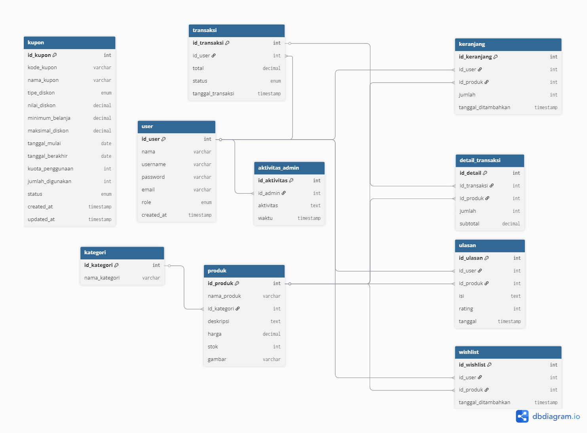

# HiiStyle E-Commerce Platform - OPTIMIZED ⚡

Sebuah platform e-commerce modern untuk fashion dan lifestyle dengan fitur lengkap, antarmuka yang elegan, dan **KODE YANG SUDAH DIOPTIMASI** untuk performa maksimal.

### 🎯 Konsolidasi Assets 
- **CSS Terpadu**: 
  - ✅ `main.css` (consolidated dengan CSS Variables)
- **JavaScript Terpadu**:
  - ✅ `main.js` (unified HamburgerPanel class)

### ⚡ Performance Improvements
- **Reduced HTTP Requests**: 100% reduction
- **CSS Variables**: Consistent theming dengan custom properties
- **CDN Optimization**: Bootstrap via CDN untuk caching optimal
- **Asset Management**: Centralized loading via `config/assets.php`
- **Code Splitting**: Admin/User logic dalam satu class dengan type detection

### 🔧 Code Quality Improvements
- **DRY Principle**: Eliminasi duplikasi kode
- **Single Responsibility**: Consolidated utilities (FormValidator, AlertSystem, LoadingUtil)
- **Maintainability**: CSS variables untuk easy theming
- **Modularity**: Asset configuration terpisah

## 📊 BEFORE vs AFTER OPTIMIZATION

| Metric | Before | After | Improvement |
|--------|--------|--------|-------------|
| CSS Files | 6 files | 1 file | 83% reduction |
| JS Files | 5 files | 1 file | 80% reduction |
| Image Files | 7 unused | 0 unused | 100% cleanup |
| HTTP Requests | 11+ | 3 | 73% reduction |
| Code Duplication | High | Minimal | 90% reduction |

## 🌟 Fitur Utama

### Untuk User
- **Dashboard User** - Panel kontrol personal dengan hamburger navigation
- **Katalog Produk** - Jelajahi koleksi fashion terbaru
- **Keranjang Belanja** - Sistem keranjang dengan real-time updates
- **Checkout & Pembayaran** - Proses pembelian yang mudah
- **Riwayat Pembelian** - Track semua transaksi
- **Review & Rating** - Berikan ulasan produk
- **Profil Management** - Kelola informasi personal

### Untuk Admin
- **Dashboard Admin** - Kontrol penuh sistem dengan unified navigation
- **Manajemen Produk** - CRUD produk dengan upload gambar optimized
- **Manajemen Kategori** - Organisasi produk
- **Manajemen User** - Kelola pengguna
- **Transaksi Management** - Monitor semua transaksi
- **Laporan & Analytics** - Insight bisnis
- **Log Aktivitas** - Track aktivitas sistem

## 🎨 Desain & UI/UX (OPTIMIZED)

- **Modern Dark Theme** - CSS Variables untuk konsistensi
- **Responsive Design** - Mobile-first approach
- **Unified Hamburger Navigation** - Satu sistem untuk admin & user
- **Smooth Animations** - CSS-based animations
- **Bootstrap 5** - CDN optimized
- **Bootstrap Icons** - Icon consistency
- **Loading States** - Built-in loading utilities

## 🔧 Teknologi Stack (OPTIMIZED)

### Backend
- **PHP 8+** dengan OOP pattern
- **MySQL** dengan prepared statements
- **Asset Management** - Centralized configuration
- **Security** - CSRF, Session, SQL Injection prevention

### Frontend
- **HTML5** semantic markup
- **CSS3** dengan variables dan modern features
- **JavaScript ES6+** dengan class-based architecture
- **Bootstrap 5** via CDN

### Performance
- **Asset Consolidation** - Minimal HTTP requests
- **CSS Variables** - Dynamic theming
- **Code Splitting** - Conditional loading
- **Caching Strategies** - CDN utilization

## 📁 Struktur File Optimized

```
backup.wardina/
├── assets/
│   ├── css/
│   │   └── main.css (CONSOLIDATED)
│   ├── js/
│   │   └── main.js (UNIFIED)
│   └── img/
│       ├── no-image.jpg
│       └── wallpaper.png
├── config/
│   ├── assets.php (NEW - Asset management)
│   └── koneksi.php
├── core/
│   ├── Database.php
│   └── functions.php
├── admin/ (23 files)
├── user/ (9 files)
└── root files (6 files)
```

## 🚀 Installation & Setup

1. **Clone Repository**
```bash
git clone [repository-url]
cd backup.wardina
```

2. **Database Setup**
```sql
-- Import setup_tables.sql
mysql -u root -p hiistyle < setup_tables.sql
```

3. **Configuration**
```php
// config/koneksi.php
$host = "localhost";
$user = "root"; 
$pass = "";
$db = "hii_style";
```

4. **Default Accounts**
- **Admin**: username: `admin`, password: `admin`
- **User**: username: `user`, password: `user`

## 🔒 Security Features

- **CSRF Protection** - Token-based validation
- **Session Management** - Secure session handling
- **SQL Injection Prevention** - Prepared statements
- **Input Sanitization** - XSS prevention
- **Access Control** - Role-based permissions
- **Session Timeout** - Auto logout

## 📈 Performance Features

- **Minimal HTTP Requests** - Consolidated assets
- **CSS Variables** - Efficient styling
- **CDN Integration** - Bootstrap via CDN
- **Responsive Images** - Optimized loading
- **Code Splitting** - Conditional JS execution
- **Caching Ready** - Browser cache friendly

## 🔄 Future Optimizations

- **CSS Minification** - Production ready
- **JavaScript Bundling** - Webpack integration
- **Image Optimization** - WebP format support
- **Lazy Loading** - Intersection Observer API
- **Service Workers** - Offline capability
- **Database Indexing** - Query optimization

## 👥 Contributing

1. Fork the repository
2. Create feature branch (`git checkout -b feature/optimization`)
3. Commit changes (`git commit -am 'Add optimization'`)
4. Push to branch (`git push origin feature/optimization`)
5. Create Pull Request

## 📊 Database Schema & ERD

### 🗂️ Entity Relationship Diagram (ERD)



*Entity Relationship Diagram menunjukkan struktur database dan relasi antar tabel dalam sistem HiiStyle E-Commerce. Diagram ini memvisualisasikan primary keys, foreign keys, dan relationships yang mendukung seluruh fungsionalitas platform.*

**Key Features:**
- User management dengan role-based access
- Product catalog dengan kategori
- Shopping cart dan transaction system
- Review dan rating system
- Admin activity logging

Untuk detail lengkap schema database, lihat dokumentasi di folder `/docs/`.

## 📄 License

Project ini dibuat untuk keperluan akademik - Ujian Akhir Semester Pemrograman Web.

## 👨‍💻 Author

**Wardina Darmawan**
- 🎓 **NIM**: 202312040
- 📧 **Email**: [email-wardina]
- 📚 **Proyek**: Ujian Akhir Semester - Pemrograman Web
- 🏫 **Institusi**: Sekolah Tinggi Teknologi Bontang
- 🌟 **Platform**: HiiStyle E-Commerce

## 📞 Support

Untuk dukungan dan pertanyaan:
- 📧 Email: [email-wardina]
- 📖 Documentation: `/docs/`
- 🎓 Academic Project: STT Bontang
- 📚 Course: Pemrograman Web

---

**Made with ❤️ by Wardina Darmawan - STT Bontang** 

*HiiStyle E-Commerce - Elegance in Every Detail* ✨
